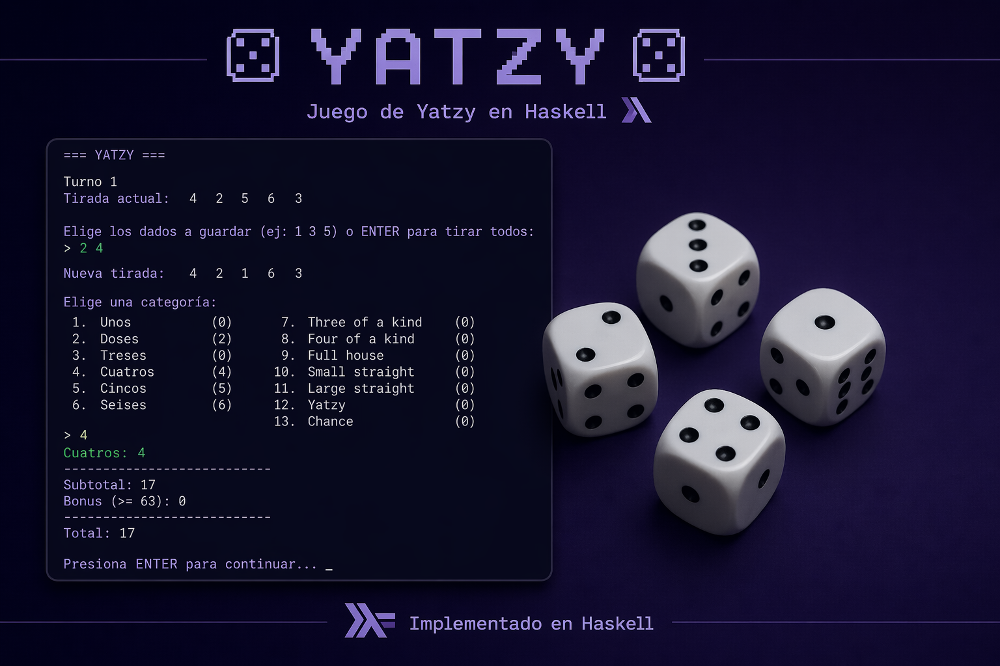

# Yatzy



A dice game **Yatzy/Yahtzee** implemented in **Haskell** with support for a desktop graphical interface and interactive web server.

---

## Project Description

Yatzy is a complete implementation of the classic dice game where players roll dice, strategically keep them, and mark combinations to earn points. The project is designed with modular architecture and offers two ways to play:

1. **Desktop (GUI)**: Graphical interface with support for playing against AI
2. **Web**: HTTP server with modern web interface for multiplayer gameplay

---

## Project Structure

```
yatzy/
├── yatzi.cabal              # Cabal configuration (dependencies and executables)
├── README.md                # This file
├── src/
│   ├── Main.hs              # Entry point for Desktop version
│   ├── ServerMain.hs        # Entry point for Web server
│   └── Game/
│       ├── Types.hs         # Main data types
│       ├── Logic.hs         # Game logic (scoring, rules)
│       ├── Server.hs        # HTTP server (REST API)
│       ├── UI.hs            # Desktop graphical interface (Gloss)
│       └── AI.hs            # Artificial intelligence system
├── frontend/                # Web application (HTML/CSS/JS)
│   ├── index.html           # Main page
│   ├── app.js               # Client logic (fetch API)
│   └── style.css            # Modern styles
└── dist-newstyle/           # Compilation artifacts
```

---

## Main Features

### Game Logic
- **5 dice** that are rolled up to 3 times per turn
- **Selective retention** of dice between rolls
- **13 valid combinations** (Ones, Twos, Threes, Fours, Fives, Sixes, Three of a Kind, Four of a Kind, Full House, Small Straight, Large Straight, Yatzy, Chance)
- **Automatic scoring system** according to Yatzy rules
- **Multiplayer support** with alternating turns

### Desktop Version
- Graphical interface rendered with **Gloss** (Graphics)
- Play against **AI** (makes automatic decisions)
- Smooth animations and intuitive visual design
- Multiple player management

### Web Version
- **Scotty server** with REST API
- Modern and responsive web interface
- In-memory game session storage
- **CORS** support for development
- Interactive user interface with JavaScript

---

## Dependencies

Dependencies are defined in `yatzi.cabal` and include:

- **base** ≥4.14: Haskell standard library
- **containers**: Data structures (Map, Set)
- **random**: Random number generation
- **aeson**: JSON serialization
- **text**: Efficient string handling
- **scotty**: Lightweight web framework
- **transformers**: Monad transformers
- **http-types**: HTTP types
- **wai-middleware-static**: Serve static files
- **gloss**: 2D graphics library

---

## Installation and Building

### Prerequisites
- GHC (Glasgow Haskell Compiler) 9.6.7 or higher
- Cabal 3.8 or higher
- Stack (optional)

### Building

```bash
# Clean previous compilations (optional)
cabal clean

# Compile the entire project
cabal build all

# Or compile each executable individually:
cabal build yatzi              # Desktop version
cabal build yatzi-server       # Web version
```

---

## Usage

### Desktop Version

```bash
cabal run yatzi
```

This will open a window with the game's graphical interface. Controls include:
- **Click on dice**: Select/deselect dice to keep
- **"Roll" button**: Roll dice (maximum 3 rolls per turn)
- **"Keep" button**: Save the selected dice
- **Click on combination**: Mark a combination and advance turn

### Web Version

```bash
cabal run yatzi-server
```

Then open your browser to:
```
http://localhost:3000
```

**Browser usage:**
1. Enter player names separated by commas (e.g., "Alice,Bob")
2. Click "Create game"
3. For each turn:
   - Click "Roll dice" (maximum 3 times)
   - Select dice to keep by clicking on them
   - Click "Keep selected"
   - Choose an available combination to score points
4. Automatically advance to next turn

---

## Scoring System

The combinations and their values are:

| Combination | Description | Score |
|------------|------------|---------|
| **Ones** | Sum of all ones | ∑ ones |
| **Twos** | Sum of all twos | ∑ twos |
| **Threes** | Sum of all threes | ∑ threes |
| **Fours** | Sum of all fours | ∑ fours |
| **Fives** | Sum of all fives | ∑ fives |
| **Sixes** | Sum of all sixes | ∑ sixes |
| **Three of a Kind** | 3+ equal dice | Total sum |
| **Four of a Kind** | 4+ equal dice | Total sum |
| **Full House** | 3 equal + 2 equal | 25 points |
| **Small Straight** | 4 consecutive dice | 30 points |
| **Large Straight** | 5 consecutive dice | 40 points |
| **Yatzy** | 5 equal dice | 50 points |
| **Chance** | Any combination | Total sum |

---

## Main Modules

### `Game.Types`
Defines the fundamental data structures:
- `Dado`: Type alias for Int (1-6)
- `Tiro`: List of dice
- `Combinacion`: Enumeration of the 13 valid combinations
- `GameState`: Complete game state (players, turn, dice, scores)

### `Game.Logic`
Implements pure game logic:
- `puntaje`: Calculates points for a combination
- `inicializarEstado`: Creates a new game
- `aplicarTirada`: Rolls random dice
- `conservarDados`: Saves selected dice
- `elegirCombinacion`: Marks a combination and advances turn

### `Game.Server`
HTTP server with REST API:
- `POST /game`: Create new game
- `GET /game/:id`: Get game state
- `POST /game/:id/roll`: Roll dice
- `POST /game/:id/keep`: Keep dice
- `POST /game/:id/choose`: Choose combination
- CORS middleware and static file serving

### `Game.UI`
Desktop graphical interface:
- Gloss rendering
- Event handling (mouse, keyboard)
- Turn animations
- AI integration

### `Game.AI`
Artificial intelligence system:
- `aiChooseDice`: Decides which dice to keep
- `aiChooseCombo`: Selects a combination strategically

---

## REST API (Web Version)

### Create Game
```http
POST /game
Content-Type: application/json

{
  "players": ["Alice", "Bob", "Charlie"]
}

Response:
{
  "gameId": 1,
  "state": { ... }
}
```

### Get State
```http
GET /game/1

Response:
{
  "turn": 0,
  "currentPlayer": "Alice",
  "dice": [3, 4, 1, 5, 2],
  "kept": [],
  "rollsUsed": 1,
  "available": ["Ones", "Twos", ...],
  "scores": [["Alice", []], ["Bob", []], ...]
}
```

### Roll Dice
```http
POST /game/1/roll

Response:
{
  "turn": 0,
  "currentPlayer": "Alice",
  "dice": [2, 5, 1, 4, 3],
  "rollsUsed": 2,
  ...
}
```

### Keep Dice
```http
POST /game/1/keep
Content-Type: application/json

{
  "indices": [1, 4]
}
```

### Choose Combination
```http
POST /game/1/choose
Content-Type: application/json

{
  "combination": "Trio"
}
```

---

## Technologies Used

| Aspect | Technology |
|--------|-----------|
| **Backend Language** | Haskell |
| **Web Framework** | Scotty |
| **Graphics (Desktop)** | Gloss |
| **Serialization** | Aeson (JSON) |
| **Frontend Language** | JavaScript Vanilla |
| **Styles** | CSS3 (Grid, Flexbox, Gradients) |
| **Build Tool** | Cabal |

---

## Development

### Watch Build Mode
```bash
# Compile automatically when files change
cabal build --enable-tests --ghc-options=-fhpc
```

### Run Tests
```bash
# If tests are defined
cabal test
```

### Recompile Everything
```bash
cabal clean && cabal build all
```

---

## Architecture Notes

1. **Separation of Concerns**: 
   - `Logic.hs` contains pure logic (no IO)
   - `Server.hs` and `UI.hs` handle IO

2. **Immutability**: 
   - Game state is immutable
   - Each operation returns a new state

3. **Multiplayer**:
   - Desktop: Alternating turns with optional AI
   - Web: Multiple simultaneous sessions in memory

4. **JSON Serialization**:
   - Types automatically derive `ToJSON`/`FromJSON`
   - Enum conversion to lowercase strings

---

## Troubleshooting

### Web server won't open in browser
- Verify that `http://localhost:3000` is accessible
- Make sure port 3000 is not in use
- Check the console for error messages

### Dice not rolling correctly
- Verify you clicked the "Roll dice" button
- Maximum 3 rolls per turn
- Kept dice are not re-rolled

### AI not playing
- AI only works in the Desktop version
- Verify that players include the AI

---

Enjoy playing Yatzy!
